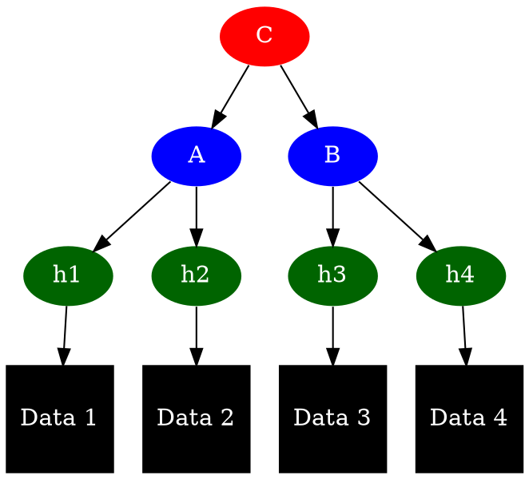
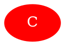
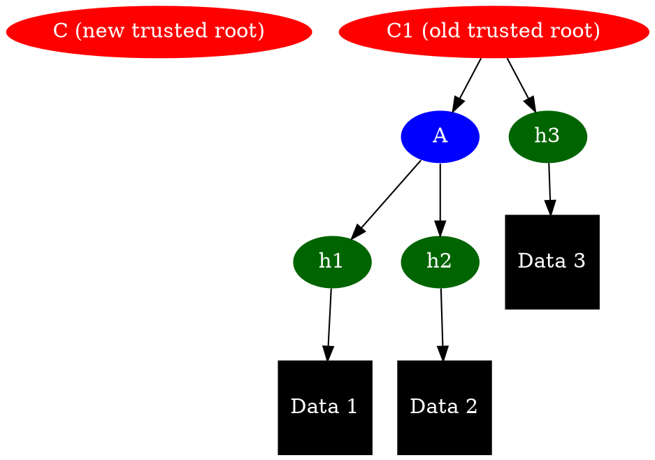
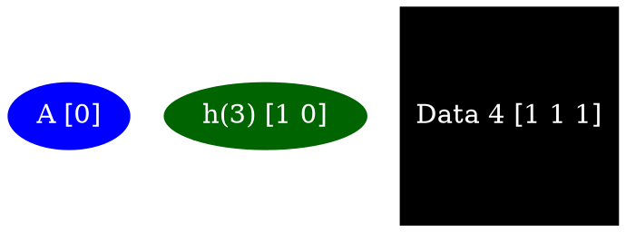
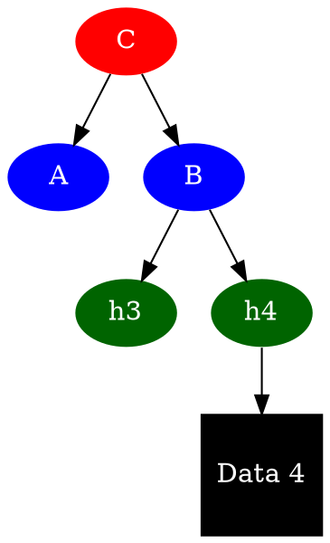

# Merkleslash

Draft by Oskar, April 18

A problem with data sync is knowing exactly what data to sync, and how you know that you are up to speed, and to do this in an efficient way. Additionally, it is desirable to allow for untrusted nodes to help out with syncing. This introduces problems when it comes to minimizing trust assumptions and incentivizating good behavior. What follows is an illustration of what this might look like.

## Assumptions

Assume C is the trusted root hash. A,B and h1..h4 are hashes. Data1..Data4 are the actual data payloads, which are encrypted.

Let's assume that:
- we know the latest trusted root hash C
- at least one other node in the network has the data for it
- there is some way to ask for this data

## Full tree view

## Initial state

Assuming the node doesn't know anything else, here's what the tree looks like from a node's point of view:

## Sync difference

Alternatively, it might look something like this:

The client realizes it is out of date, and sends a request to the untrusted node saying: I have C, A, and h3, please give me the latest. This means the untrusted node can send the following back:

## Sync partial state

Alternatively, if the client only wants partial state, say, Data 4 (and it knows its hash, h4), it can say "I have C, and I want data that h(4) points to".  This means the untrusted node only needs to reply with the same data as above:

And the resulting client state looks like:

And the clients knows what to ask for if it needs more information.

## Slashing and conditions

A super rough sketch. Note that this scheme would work without this, though it'd be reliant on altruistic behavior. Let's assume:
- the client have put up some form of payment, either in a contract, payment channel, or per fetch. It can also be a proof of payment per request.
- the untrusted node have put up some slashable deposit.

Rough flow:
1. The client node requests some data.
2. Based on payment, the endpoint sends this data and takes the money.
3. The client node uses Merkle proofs to verify that the data is indeed correct.
4. If it isn't correct, it can slash that node as being bad.
5. To avoid an infinite griefing factor (though this might be fine for pairwise interactions and small sums a la choke/unchoke in BT? needs more analysis), the endpoint can submit a Merkle proof to some mechanism.
6. Magic where some random other party verifies the Merkle proof, and divides funds between itself/endpoint/burns in a game-theoretically optimal way.

Alernatively, look into choke/unchoke and swap/swear/swindle a la Swarm for other models of this. The point is that we can leverage Merkle proofs once there's a clear request and a trusted root.

## Notes

- For initial exploration of this, see https://github.com/status-im/status-research/tree/master/merkleslash. It's very WIP though. Contributions welcome.

- This means there's no need for any form of bandwidth or storage tests, as the data itself provides this guarantee.

- There are some subtleties when it comes to position in tree.

- It's worth looking into more how appending of data works efficiently, i.e. Patricia trees and the likes.

- Trusted root is out of band/scope, but can be e.g. Swarm Feed, be published by signed participant over Whisper, etc.

- Credit to graph style comes from this presentation: https://www.youtube.com/watch?v=3giNelTfeAk

---

*Source: https://notes.status.im/MLGgpdgqRzeyTqVWkl7gjg# (lets see if graphviz works in GH?)*

