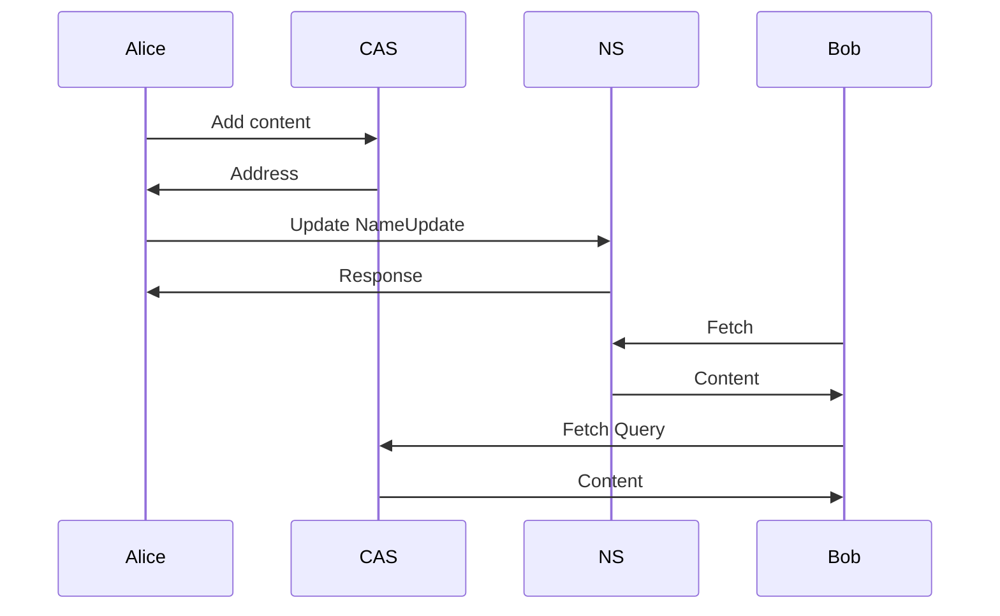

# Remote log specification

<!-- Live version atm: https://notes.status.im/HPLXoeM3Sn6e8sG8TQ2Clw# -->

> Version: 0.1 (Draft)
>
> Authors: Oskar Thorén oskar@status.im, Dean Eigenmann dean@status.im

## Table of Contents

TBD.

## Abstract

A remote log is a replication of a local log. This means a node can read data
from a node that is offline.

## Definitions

| Term        | Definition                                                                             |
| ----------- | -------------------------------------------------------------------------------------- |

## Roles

1. Node
2. Name system (NS)
3. Content-addressed storage (CAS)

As well as the *remote log* payload.

## Wire Protocol

### Payloads

#### CAS service
```protobuf
package vac.cas;

service CAS {
  rpc Add(Content) returns (Address) {}
  rpc Get(Address) returns (Content) {}
}

message Address {
  bytes id = 1;
}

message Content {
  bytes data = 1;
}
```

##### NS service

```protobuf
service NS {
  rpc Update(NameUpdate) returns (Response) {}
  rpc Fetch(Query) returns (Content) {}
}

message NameUpdate {
  string name = 1;
  bytes content = 2;
}

message Query {
  string name = 1;
}

message Content {
  bytes data = 1;
}

// XXX: Anything? Ok/Error, enum?
// XXX: Also bad naming
message Response {
  bytes data = 1;
}
```

<!-- // TODO: NameInit? -->

#### Remote
```protobuf
message RemoteLog {
  Body body = 1;
  bytes tail = 2;

  message Body {
    repeated Pair pair = 1;
  }

  message Pair {
    bytes remoteHash = 1;
    bytes localHash = 2;
  }
}
```

## Flow

<!-- This section is only here for research right now, might move or be unnecessary -->

<!-- Wil likely be replaced with similar flow to one in MVDS.spec -->



<!-- 


## Footnotes

TBD.

## Acknowledgements

TBD.
