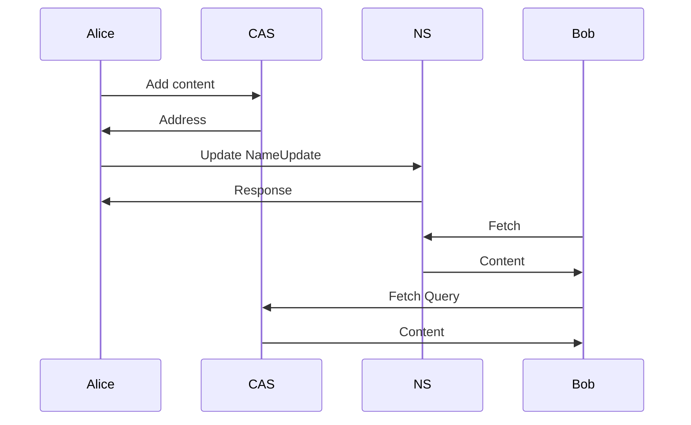

# Remote log specification

> Version: 0.0.3 (Draft)
>
> Authors: Oskar Thorén oskar@status.im, Dean Eigenmann dean@status.im

## Table of Contents

- [Abstract](#abstract)
- [Definitions](#definitions)
- [Roles](#roles)
- [Wire Protocol](#wire-protocol)
    - [Secure Transport, Storage, and Name System](#secure-transport-storage-and-name-system)
    - [Payloads](#payloads)
- [Flow](#flow)
- [Footnotes](#footnotes)
- [Acknowledgements](#acknowledgements)

## Abstract

A remote log is a replication of a local log. This means a node can read data
from a node that is offline.

## Definitions

| Term        | Definition                                                                                   |
| ----------- | --------------------------------------------------------------------------------------       |
| CAS         | Content-addressed storage. Stores data that can be addressed by its hash.                    |
| Name system | Name system. Associates mutable data to a name.                                              |
| Remote log  | Replication of a local log at a different location.                                          |

## Roles

1. Node
2. Name system (NS)
3. Content-addressed storage (CAS)

## Wire Protocol

### Secure Transport, Storage, and Name System

This specification does not define anything related to to: secure transport,
content addressed storage, or the Name System. It is assumed these capabilities
are abstracted away in such a way that any such protocol can easily be
implemented.

<!-- TODO: Elaborate on properties required here. -->

### Payloads

Payloads are implemented using [protocol buffers v3](https://developers.google.com/protocol-buffers/).

**CAS service**:

```protobuf
package vac.cas;

service CAS {
  rpc Add(Content) returns (Address) {}
  rpc Get(Address) returns (Content) {}
}

message Address {
  bytes id = 1;
}

message Content {
  bytes data = 1;
}
```

**NS service**:

```protobuf
service NS {
  rpc Update(NameUpdate) returns (Response) {}
  rpc Fetch(Query) returns (Content) {}
}

message NameUpdate {
  string name = 1;
  bytes content = 2;
}

message Query {
  string name = 1;
}

message Content {
  bytes data = 1;
}

message Response {
  bytes data = 1;
}
```

<!-- XXX: Response and data type a bit weird, Ok/Err enum? -->
<!-- TODO: Do we want NameInit here? -->

**Remote log:**

```protobuf
message RemoteLog {
  Body body = 1;
  bytes tail = 2;

  message Body {
    repeated Pair pair = 1;
  }

  message Pair {
    bytes remoteHash = 1;
    bytes localHash = 2;
  }
}
```

<!-- TODO: Extend pair with (optional) data -->

## Flow

<!-- This section is only here for research right now, might move or be unnecessary -->

<!-- Wil likely be replaced with similar flow to one in MVDS.spec -->



<!-- 


## Footnotes

TBD.

## Acknowledgements

TBD.
