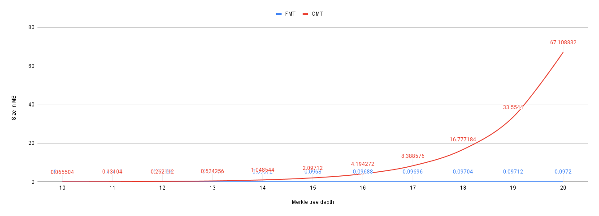

# Waku-RLN-Relay: Evaluating Storage Overhead of Membership Merkle Tree   
## Introduction

In the current design of the Waku-RLN-Relay protocol, the membership Merkle tree (MT) is locally persisted by peers. This incurs some storage overhead which may or may not fit resource-limited devices. This overhead also depends on the algorithm used to represent the Merkle tree. So far, we are aware of two algorithms namely, Full Merkle tree (FMT) and Optimal Merkle tree (OMT), and in this post, we would like
1) to compare the two existing MT algorithms and clarify their differences in terms of storage requirements.
2) to determine whether the storage overhead of the membership MT fits the resource-limited devices. 
3) depending on the second item, then we can decide on whether more research on the MT storage optimization is required or not.

**Existing Merkle tree algorithms**: In the present post, we analyze two different MT algorithms:
- Full Merkle tree (FMT): in this algorithm, an empty full tree with a specific depth is being initialized and the required memory space is allocated upfront. The values of the existing nodes are altered as new nodes are added to the tree.
- Optimal Merkle tree (OMT): In this algorithm, which is implemented in the  [killic library](https://github.com/status-im/rln/blob/master/src/merkle.rs), the Merkle tree nodes are generated incrementally as new leaves are being added to the tree.

## Storage Overhead Analysis
 
**Per-app memory cap**: Before starting the analysis, it is worth reviewing the per-app memory cap on mobile devices (Android and iOS) which are more resource-restricted compared to desktop nodes. Note that these values are not accurate and not evaluated by us, and merely to give some intuition on per-app memory contraints:
>  Early Android devices had a per-app memory cap of 16MB. Later this cap increased to 24MB or 32MB. 
> iPhone 5s (iOS 10, debug mode, 1GB memory): 600MB can be allocated
> iPad Air 2 (iOS 11.4, 2GB memory): 1.3GB can be allocated
> iPhone X (iOS 11.4, 3GB memory): 1.2GB can be allocated
> iPhone 7 Plus (iOS 12.1, 3GB memory): 1.8GB can be allocated
> iPad 13-inch (iOS 11.4, 4GB memory): 3GB can be allocated

Assuming that the MT is going to be loaded in memory, then we are facing the limit of `32MB` on Android devices and `600MB` on iOS devices.

**Terminologies**: In this analysis, we use the following terminologies:
- Tree depth denoted by `d`: The binary logarithm of the maximum number of leaves in a Merkle tree
- Tree capacity denoted by `cap`: the maximum number of leaves in a tree with depth `d`  which can be calculated as`2^d`
- Tree size (or group size, interchangeably):  the current number of leaves inserted into the tree (i.e., the current number of members in the group) which is less than or equal to the tree capacity.

The hash function used in the simulations is the Poseidon hash function with the output size of `256` bits/ `32` bytes. The Poseidon hasher parameters are `rf:8, rp:55, t:3`.

### Full Merkle Tree Algorithm (FMT)
The FMT algorithm uses an array with `2*(2^d)-1` entries to represent a Merkle tree with depth `d`. Each entry represents a Merkle tree node of size `32` bytes (corresponding to the`256` bits hash value). The entire array is allocated upfront. The storage complexity of FMT is exponential in the depth of the tree i.e., `O(2^d)`.

**Group size = Tree capacity** The following diagram depicts the storage overhead in Megabytes for different tree depths i.e.,  `d=[1..20]`. As expected, the overhead increases exponentially with `d`. In the worst-case scenario, a tree of depth `20` requires `67.10 MB` of storage.

**Group size < Tree capacity**: In FMT, the group size does not affect the storage overhead because the required space for the full tree is allocated at the beginning; further updates on the tree only alter the existing values.  For example, at `d=20`, the storage overhead is `67` MB even if the current group size is `1000`. 
Therefore, in the FMT algorithm,  it is best to set the tree depth close to the expected group size to save storage space.

### Optimal Merkle Tree Algorithm (OMT)
In this algorithm, each Merkle tree node is indexed by two values each of size `8` bytes on a 64-bit machine (`4` bytes on a 32-bit machine). As such, each tree node takes up `2*8 +32 = 48` bytes corresponding to the size of indices and the hash output.

**Group size = Tree capacity** The following figure demonstrates the maximum storage overhead (i.e., when group size is equal to tree capacity) over varying tree depths i.e., `d=[1..20]`. 

**Group size < Tree capacity**
In the OMT algorithm, a hash-map is used to instantiate a Merkle tree. Nodes are added to this map gradually as new leaves are added to the tree. Each MT node encapsulates a 32-byte hash value and index of size `16` bytes.  
Unlike FMT, since space allocation is done incrementally, the storage overhead is a function of the group size and is less affected by the tree depth. Below, we demonstrate this fact for a tree with a depth of `20`. Under this depth, for a group size of `1000`, the storage overhead is `0.097` MB which is almost `1000` times less than the storage overhead of a full tree with depth `20` i.e., `100` MB.

But what is the impact of the tree depth on the storage overhead? if we set the tree depth so high at the beginning but later realize the group size is much less than that, how much storage space do we lose? Does it matter to set the Merkle tree depth close to the expected group size? The short answer is no, unlike FMT, it does not make a significant difference. The following simulation results will explain why. 
Below, we demonstrate the storage requirement to persist a group of size`1000`  under different Merkle tree depths: `d=[10..20]`. 

d=`10` `96400` bytes
d=`11` `96480` bytes
d=`12` `96560` bytes
d=`13` `96640` bytes
d=`14` `96720` bytes
d=`15` `96800` bytes
d=`20` `97200` bytes

As the results show, the storage overhead increases by an additive factor of `80 bytes` for every extra depth. Take `d=10` and `d=11` as an example, the difference in their storage overhead is `96480 - 96400 = 80` bytes. This trend holds for any other group size.  Thus, if the Merkle tree depth is set to `d=20`, and we end up having a group size of only `1024` members i.e., `2^10` members, then the extra storage overhead is `(20-10) *80 = 0.8 KB` bytes which can be considered minimal and insignificant.
Note that this analysis is only valid for the storage overhead, however, setting a higher value for the depth may have a different impact on the computational load. This needs to be evaluated separately.

### FMT vs OMT

Comparing the max storage overhead of FMT and OMT, as depicted in the figure below, brings us to the conclusion that FMT is more efficient than OMT. However, this is only true for the worst-case scenario where the group is full to the maximum tree capacity.

But, this worst-case scenario does not always hold, instead, in most states of the system, the group size is much less than the tree capacity. In the following figure, we take a snapshot of the system at group size `1000`. In this snapshot, we compare the storage overhead incurred by FMT and OMT for `d=[10..20]`.

As you can see, in this more realistic scenario, OMT shows better performance than FMT. For example, for `d=20`, persisting a group of `1000` members using OMT requires  `0.097 MB` whereas it requires `67.1 MB` when using FMT, which is `700` times more than OMT.

It brings us to another conclusion that OMT outperforms FMT when group size is less than the tree capacity. However, the exact point at which this relationship changed needs more investigation.

## Conclusion
1) Storage overhead of membership MT does not seem to be an issue for desktop nodes given that the maximum overhead to persist an MT for a large group of `2^20` and `2^10` members does not exceed `100 MB` (see below for more accurate numbers).

| Algorithm\Tree depth | d=10      | d=20      |
| -------------------- | --------- | --------- |
| FMT                  | 0.065  MB | 67.10 MB  |
| OMT                  | 0.098  MB | 100.66 MB |

However, the MT storage overhead may not be reasonable for mobile devices especially if we plan to load the MT in memory in which case we will/may face the per-app memory cap of `32 MB` on Android phones.

2) If we can not predict the maximum group size (hence the max tree depth), then it is more efficient to use the OMT algorithm. This is because the storage overhead of OMT is proportional to the group size and less affected by the tree depth.  For instance, consider a tree with a depth of `20` and with `1000` active leaves. MT storage using OMT requires  `0.097 MB` whereas  `67.1 MB` when using FMT, `700` times more than OMT.  However, the exact point at which this relationship may change needs more investigation.
3) If the maximum group size is known, then it would be more efficient to use FMT.

## Next Steps
The results presented in this post so far suggest that no further MT storage optimization is needed. However, this conclusion is not necessarily extendable to the computational overhead of MT. Hence, evaluating the computational overhead can be considered the next step.

