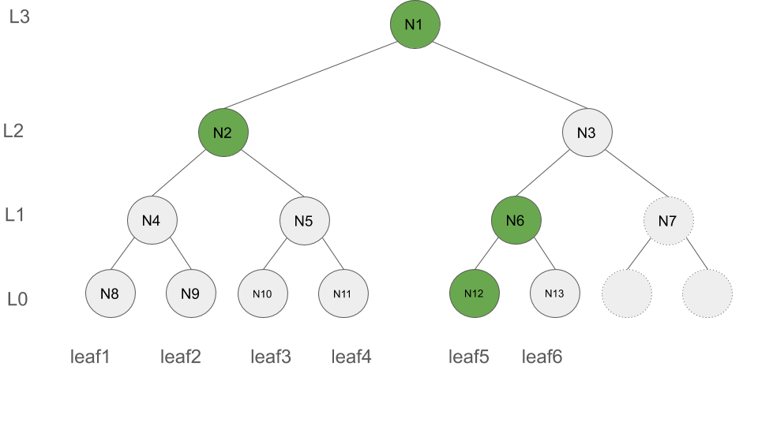
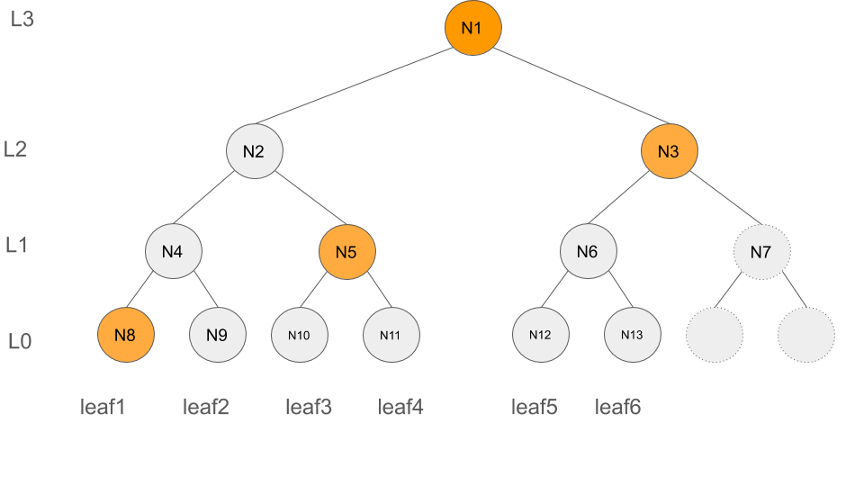
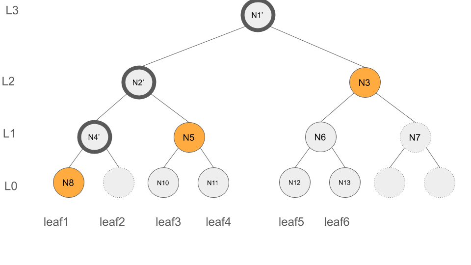

# Probelm Definition
### On chain Tree storage
In the current implementation of the rln, where the membership contract contains the membership tree, only the insertion of a new member is supported but the deletion operation is not part of the smart contract functionality. Note that performing tree insertion is a costly operation for the peers, since it involve O(log(n)) many expensive hashing which results in a huge gas consumption. It almost costs 50 dollars for one single insertion. This problem has been addressed through batch insertions, where the costs of insertion gets amortized over multiple sequential insertions hence each peer has to pay less (for further details read ...). 

**Cons**: While batch insertion can address the cost of tree insertion, yet no clear solution exists for a single deletion operation and it would be still costly (around 100 dollars for each deletion). The batch deletion can not be applied since the deleted nodes are scattered accross the tree leaves.

### Off-chain Tree storage
The dicussion above brings us to the second possible approach in which the tree construction, storage and maintenace will be delegated to the peers thus no tree gets stored on the chain. 
The smart contract will only store an ordered list of existing members public keys i.e., pk. The member deletion happens by replacing the member's pk in the list with a special value like 0. Peers need to listen to the events on the chain to update their local const5ructed trees.

In the off-chain tree storage, peers are responsible for the construction and maintenance of the membership tree. To do so, the peers must maintain enough number of nodes of the tree that enables them to update the tree in the case of deletion and insertion of members. While an optimal solution exists to efficiently support insertion (the solution imposes only O(logn) storage complexity where n is the total number of members), efficiently supporting deletion is still an unknown. 

The immediate remedy is that the entire tree shall be stored by each peer, however, this solution is storage inefficient due to the size of the tree. This requires almost ... GB of storage at each peer. Provided that peers are resource constrained, such solution does not fit. 

### Updating authentication paths
For the sake of privacy and anonymity, peers need to update their authentication path based on the recent list of members i.e., the authentication path must be updated after each insertion and deletion.
An immediate solution for this is to store the entire tree at each peer, which is not storage efficient and does not fit for the resource constrained peers. 


# Solution Overview

In the solution explained below, we enable a peer to to perform the operations described in [Formal Problem Definition](#Formal-Problem-Definition) by only holding O(logn) many tree nodes (but not the entire tree).

The solution relies on the following statement:
> In a Merkle Tree with the capacity of `n` leaves , one can compute the root of the tree by maintaining the root nodes of log(n) number of complete Merkle trees. 

We use the preciding  observation and define `F = [(L:0, H0, leafIndex0), ..., (L:d, Hd, leafIndexd)]` to be an array of size log(n)+1 holding the root of the complete Merkle trees (all positioned on the left side of the tree) for levels `[0, ..., d=log(n)]`. Each entry of `F`  is a tuple `(L, leafIndex, H)` in which `H`is the root of the complete subtree at level `L`, and  `leafIndex` indicates the index of the leaf node whose insertion resulted in `H`. The storage of `leafIndex` in each tuple will later enables the efficient support of deletion operation.  Each peer shall store `F` locally.

For the Merkle Tree shown in Figure below, `F = [(L:0, N12, leafIndex:5), (L:1, N6, leafIndex:6), (L:2, N2, leafIndex:4), (L:3, N1, leafIndex:6)]` is highlighted in green. Note that `F` only contains the green nodes but none of the gray nodes.




## Computing the root after deletion

Given that `F` is stored by each peer locally, we demonestrate how deletion can be supported relying on `F`.

When a node gets deleted, its authentication path is available, and the following solution relies on that.

Consider the deletion of the `leafIndex:i` with the authentication path / (membership proof) of the follwoing form `authpath = [(L:0, H0), ..., (L:d, Hd)]` where in each tuple `H`  represents the value of the merkle tree node along the authentication path of leaf `i` at the corresponding level `L`. Note that `d` varies from `0` to `logn`. The last entry of `authpath` i.e., `(L:d, Hd)` is indeed the tree root.

The authentication path of `leafIndex:2`  is illustrated in the following figure (highlighted in yellow) and consists of `authpath2 = [(L:0, N8), (L:1, N5), (L:2, N3), (L:3, N1)]`.



We need to update `F` based on `authpath2`. In specific, we need to determine whether any of the nodes whose values get altered as the result of deletion of a leaf node intersect with the nodes in `F`, and if this is the case the corresponding nodes in `F` shall get updated too.

Lets clarify it by the help of an example. Consider `leafIndex:2`, the deletion of `leafIndex:2` impacts `N9 (level 0), N4 (level 1), N2 (level 2)` and  `N1 (level 3)`(root) of the tree, as illustrated below with the dark circles. 



Thus, in order to update `F`, we need to update those entries of `F` that contain `N9, N4, N2` or `N1`. 

To do so, we determine whether for each tuple `(L, leafIndex, H)` in `F`,  the `leafIndex` and the deleted leaf node have the same ancestor at level `L`. We use `HasCommAnc` method to perform this check, it is later defined in [Common ancestor](###Common-Ancestor ) subsection. For example, `leaf2` and `leaf4` have the same ancestor at level 2, which is `N2`, thus `HasCommAnc(2,4,2)` return true.

Following our previous example, in order to find out whether `N9, N4, N2` or `N1` belong to `F` we proceed as follows.
- inputs: 
  - Index of the deleted node `leafIndex:2`
  - `F = [(L:0, N12, leafIndex:5), (L:1, N6, leafIndex:6), (L:2, N2, leafIndex:4), (L:3, N1, leafIndex:6)]` 
  <!-- - This is not part of the inputs, but just for the ease of explanation, Altered nodes `=[(L:0,N9'), (L:1,N4'), (L:2,N2'), (L:3,N1')`-->

- Update procedure of `F`: 
  - level `L:0`, HasCommAnc(leafIndex:2, leafIndex:5, L:0) = false, thus `F` does not change
  - level `L:1`, HasCommAnc(leafIndex:2, leafIndex:6, L:1) = false, thus `F` does not change
  - level `L:2`, HasCommAnc(leafIndex:2, leafIndex:4, L:2) = true, thus `F = [(L:0, N12, leafIndex:5), (L:1, N6, leafIndex:6), (L:2, N2', leafIndex:4), (L:3, N1, leafIndex:6)]` 
  - level `L:3`, HasCommAnc(leafIndex:2, leafIndex:6, L:3) = true, thus `F = [(L:0, N12, leafIndex:5), (L:1, N6, leafIndex:6), (L:2, N2', leafIndex:4), (L:3, N1', leafIndex:6)]` 
- Output
  - `F' = [(L:0, N12, leafIndex:5), (L:1, N6, leafIndex:6), (L:2, N2', leafIndex:4), (L:3, N1', leafIndex:6)]` 


### Common Ancestor 
In order to determine whether two nodes with indices `i` and `j` have common anscestor at a particular level `lev`, the followong formula can be applied

check whether `floor( (i-1)/2^lev )` is equal to `floor( (j-1)/2^lev )`


# Update tree root after deletion
- Inputs (the levels i.e., `L` values are removed since the position of each entry can represent its level): 
  - `F = [(H0,index0), ..., (Hd,indexd)]`
  - `leafIndex` ( The index of the deleted leaf)
  -  `authpath = [H0, ..., Hd]` (The authentication path of the deleted leaf)
  -  `Z = [H(0), H(Z[0]||Z[0]), H(Z[1]||Z[1]), ..., H(Z[d-1]||Z[d-1])]`
- Output: `F` which is the updated `F`
    
```
path = binary representation of leafIndex - 1
acc = Z[0]
for lev in 0..d # d inclusive
  if HasCommAnc(leafIndex, F[lev].index,lev) == true # F[lev].index has common ancestor with leafIndex at level lev 
    F[l] = acc
  if the last bit of path is 1
    acc = H(authPath[lev], acc)
  else
    acc = H(acc, authPath[lev])
  shift path right by 1
```
```
HasCommAnc(i, j, lev) =
  return floor( (i-1)/2^lev ) == floor( (j-1)/2^lev )
```

# Updating authentication paths

Lets index the tree nodes following the formula below, for each tree node with index `i`, its right and left child have index `2*i` and `2*i+1`, respectively. The root has index `1`. The sample tree is illustrated below.

When a node gets deleted, 

While writing up the preceding solution, I came up with a simiplified version in which we do not need to store the the leaf indices, instead we can compute them on the fly. 
