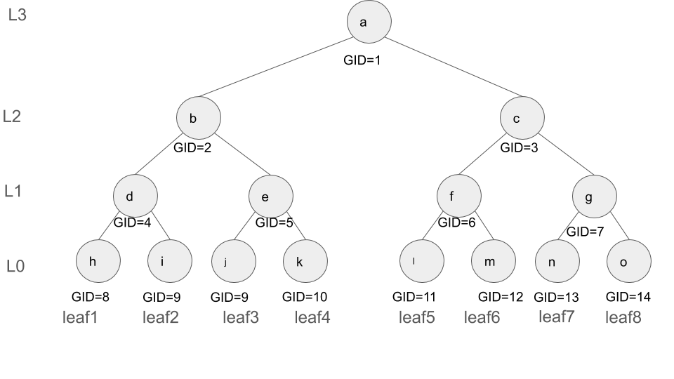
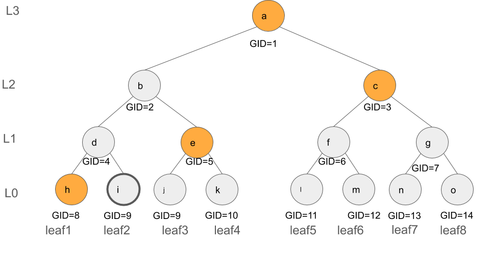

# Probelm Definition
## On-chain tree storage
In the current implementation of the rln, where the membership contract contains a Merkle tree holding the list of current members, the contract only supports the insertion of a new leaf, but not deletion. In addition to the lack of deletion support on the contract, it seems that even the most efficient scenario with logarithmic complexity would not be cost-efficient (since it involves almost 2.log(N) many expensive hashing which results in huge gas consumption.)


**Hint**: While batch insertion can address the cost associated with insertion, the idea of batch deletion can not be applied since the deleted nodes are scattered across the tree (leaves).

## Off-chain tree storage
The discussion above brings us to the second possible approach in which the tree construction, storage, and maintenance will be delegated to the peers thus no tree gets stored on the chain. 
The smart contract will only store an ordered list of existing members' public keys i.e., pk. In the list representation, when a member is deleted its pk is replaced with a special value. Peers need to listen to the events on the chain (i.e., insertion and deletion) to update their local constructed trees.

In the off-chain tree storage, peers are responsible for the construction and maintenance of the membership tree (specifically the root). To do so, the peers must maintain enough number of nodes of the tree that enables them to calculate the updated tree root in the case of deletion and insertion of members. While an optimal solution exists to efficiently support insertion (the solution imposes only O(log(N)) storage complexity where n is the total number of members), efficiently supporting deletion is still an unknown. 

One immediate solution is that the entire tree shall be stored by each peer, however, this solution is storage-inefficient due to the size of the tree. Provided that peers are resource-constrained, such a solution does not fit. Moreover, it will require peers to store the tree in a database and hence can negatively affect their performance.

## Updating authentication paths
In addition to the calculation of tree root, peers also need to update their authentication path based on the recent list of members i.e., the authentication path must be updated after each insertion and deletion. This is essential for peers' anonymity.
An immediate solution for this is to store the entire tree on each peer, which, as we mentioned before, is not storage efficient and does not fit for the resource-constrained peers. 


## Formal Problem Definition
We are seeking a solution in which a peer can perform the following operations by keeping the minimum possible number of tree nodes
- recalculate the root after a member insertion
- recalculate the root after a member deletion
- recalculate an authentication path after an insertion
- recalculate an authentication path after a deletion
  

# Solution Overview

In the solution explained below, we enable a peer to perform the operations described in [Formal Problem Definition](#Formal-Problem-Definition) by only holding O(log N) many tree nodes (but not the entire tree). Our focus is on supporting the deletion operation (the insertion will be similar).


## Computing the root after deletion

The solution relies on the following statement:
> In a Merkle Tree with the capacity of `N` leaves, one can compute the root of the tree by maintaining the root nodes of log(N) number of complete Merkle trees. 

We use the preceding  observation and define `F = [(L:0, H0, leafIndex0), ..., (L:d, Hd, leafIndexd)]` to be an array of size log(N)+1 holding the root of the complete (left) sub-trees for levels `[0, ..., d=log(N)]`. Each entry of `F`  is a tuple `(L, leafIndex, H)` in which `H` is the root of the complete subtree at level `L`, and  `leafIndex` indicates the index of the leaf node whose insertion resulted in `H`. The storage of `leafIndex` in each tuple will later enables the efficient support of deletion operation.  Each peer shall store `F` locally.

For the Merkle Tree (with 6 leaves) shown in Figure below, `F` is highlighted in green and has the following value  `F = [(L:0, N12, leafIndex:5), (L:1, N6, leafIndex:6), (L:2, N2, leafIndex:4), (L:3, N1, leafIndex:6)]`. Note that `F` only contains the green nodes but none of the gray nodes.


Given that `F` is stored by each peer locally, we demonstrate how deletion can be supported relying on `F`.

When a node gets deleted, its authentication path is available, and the following solution relies on that.

Consider the deletion of the `leafIndex: i` with the authentication path / (membership proof) of the following form `authpath = [(L:0, H0), ..., (L:d, Hd)]` where, in each tuple, `H`  represents the value of the Merkle tree node along the authentication path of the leaf `i` at the corresponding level `L`. Note that `d` varies from `0` to `log(N)`. The last entry of `authpath` i.e., `(L:d, Hd)` is indeed the tree root.

The authentication path of `leafIndex:2`  is illustrated in the following figure (highlighted in yellow) and consists of `authpath2 = [(L:0, N8), (L:1, N5), (L:2, N3), (L:3, N1)]`.


We need to update `F` based on the given `authpath`. In specific, we need to determine whether any of the nodes whose values get altered as the result of the deletion of a leaf node are also part of `F`, and if this is the case the corresponding nodes in `F` shall get updated too.

Let's clarify it with the help of an example. Consider `leafIndex:2`, the deletion of `leafIndex:2` impacts `N9 (level 0), N4 (level 1), N2 (level 2)` and  `N1 (level 3)`(root) of the tree, as illustrated below with the dark circles. Thus, to update `F`, we need to update those entries of `F` that contain `N9, N4, N2` or `N1`. 


To do so, we determine whether, for each tuple `(L, leafIndex, H)` in `F`,  the `leafIndex` and the deleted leaf node have the same ancestor at level `L`. We use `HasCommAnc(i,j,lev)` method to perform this check, it is later defined in [Common Ancestor](###common-ancestor) subsection. For example, `leaf2` and `leaf4` have the same ancestor at level 2, which is `N2`, thus `HasCommAnc(2,4,2)` returns true.

Following our previous example, in order to find out whether `N9, N4, N2` or `N1` belong to `F` we proceed as follows.
- inputs: 
  - Index of the deleted node `leafIndex:2`
  - `F = [(L:0, N12, leafIndex:5), (L:1, N6, leafIndex:6), (L:2, N2, leafIndex:4), (L:3, N1, leafIndex:6)]` 

- Update procedure of `F`: 
  - level `L:0`, HasCommAnc(leafIndex:2, leafIndex:5, L:0) = false, thus `F` does not change
  - level `L:1`, HasCommAnc(leafIndex:2, leafIndex:6, L:1) = false, thus `F` does not change
  - level `L:2`, HasCommAnc(leafIndex:2, leafIndex:4, L:2) = true, thus `F = [(L:0, N12, leafIndex:5), (L:1, N6, leafIndex:6), (L:2, N2', leafIndex:4), (L:3, N1, leafIndex:6)]` 
  - level `L:3`, HasCommAnc(leafIndex:2, leafIndex:6, L:3) = true, thus `F = [(L:0, N12, leafIndex:5), (L:1, N6, leafIndex:6), (L:2, N2', leafIndex:4), (L:3, N1', leafIndex:6)]` 
- Output
  - `F' = [(L:0, N12, leafIndex:5), (L:1, N6, leafIndex:6), (L:2, N2', leafIndex:4), (L:3, N1', leafIndex:6)]` 


### Common Ancestor 
To determine whether two leaves with indices `i` and `j` have a common ancestor at a particular level `lev`, the following formula can be applied

check whether `floor( (i-1)/2^lev )` is equal to `floor( (j-1)/2^lev )`
```
HasCommAnc(i, j, lev) =
  return floor( (i-1)/2^lev ) == floor( (j-1)/2^lev )
```

### Pseudocode
- Inputs (the levels i.e., `L` values are removed since the position of each entry can represent its level): 
  - `F = [(H0,index0), ..., (Hd,indexd)]`
  - `leafIndex` ( The index of the deleted leaf)
  -  `authpath = [H0, ..., Hd]` (The authentication path of the deleted leaf)
  -  `Z = [H(0), H(Z[0]||Z[0]), H(Z[1]||Z[1]), ..., H(Z[d-1]||Z[d-1])]`
- Output: the updated `F`
    
```
path = binary representation of leafIndex - 1
acc = Z[0]
for lev in 0..d # d inclusive
  if HasCommAnc(leafIndex, F[lev].index,lev) == true # F[lev].index has common ancestor with leafIndex at level lev 
    F[l] = acc
  if the last bit of path is 1
    acc = H(authPath[lev], acc)
  else
    acc = H(acc, authPath[lev])
  shift path right by 1
```


## Updating authentication paths

Note that in the solution below no extra storage is required at the peers, yet peers can update their authentication path after an update.

### Node labeling and changing the structure of authentication paths
Consider the following labeling procedure that assigns a label `GID` to each node of the tree. The labeling procedure is as follows. For each tree node with the index `GID`, the `GID` of its right and left children are  `2*GID` and `2*GID+1`, respectively. The procedure starts by assigning `GID` of  `1` to the tree root. The sample labeled tree is illustrated below. This labeling mechanism allows to uniquely address each tree node through its GID. 



We utilize this labeling mechanism, to efficiently update peers' authentication paths when a new join or deletion occurs. The general idea is each peer stores the GID of the tree nodes along her authentication path (in addition to the hash values). As such, when an update occurs, the peer identifies the GID of the nodes of the tree that are altered as the result of the update operation and checks whether any of them (based on the GIDs) are part of its authentication path. If yes, then she updates the corresponding nodes in her authentication path. We will later see in [Simplification section](###Simplification) that `GID`s can be computed on the fly hence are not required to be stored as part of authentication paths.

The authentication path shall be of the following structure `authPath=[(H_0, GID_0), ..., (H_d, GID_d)]` where `H_i` indicates the hash value of the node, and `GID_i` signifies the GID of that node. The authentication path of leaf2 is depicted below and has the following values `authPath=[(h,8), (e,5), (c,3), (a,1)]`. 


### Updating the authentication path 
Next, we demonstrate how to update a peer's authentication path when a deletion operation occurs.
Consider a peer with `leafIdex_peer` and the authentication path as `authPath_peer=[(H_0,GID_0), ..., (H_d, GID_d)]`.  Also, assume a peer with the leaf index of `leafIndex_del` is going to be deleted and has the authentication path `authPath_del`.

The update procedure is as follows:
- calculate the indices of the altered nodes. Note that all the ancestors of the deleted leaf node get altered as the result of the deletion of that node, so we calculate the GIDs of its ancestors at level `i = [0, ..., d=log(N)]`
  - The GID of the deleted leaf is `GID_leaf_del = leafIndex_del + (2^d) - 1`
  - The GID of the ancestor (of the deleted leaf) at level `i` is `GID_leaf_del_anc_i = floor( GID_leaf /(2^i))` (this is equivalent to shifting `GID_leaf ` to right by `i` bits)
- Lets `A=[GID_leaf_del, ..., GID_leaf_del_anc_d]` where `d=log(N)`
- Find the intersection of `A` and `authPath_peer` i.e.,  nodes on the peer's authentication path whose GIDs belong to `A`. Once found, replace their hash values with the updated ones.

An example: 
Consider a peer holding leaf 6, with  the authentication path `authPath_peer=[(l,11), (g,7), (b,2), (a,1)]`
that recevies the deletion of `leafIndex_del:2` with the `authPath_del= [(h,8), (e,5), (c,3), (a,1)]`
- Calculate the GID of the latered nodes, `GID_leaf_del= leafIndex_del + (2^d) - 1 = 2 + 7 =9` thus `A=[9, floor(9/2)=4, floor(9/2^2)=2, floor(9/2^3)=1]`. Also assume the corrresponding altered hash values of the ancestors (corresponding to the GIDs in `A`) are  `i', d', b', a'`, respectively.
- Among the latered node, GIDs `2` and `1` belong to  `authPath_peer` hence the corresponding hash values must be updated to `b'` and `a'`, respectively. Thus the updated authenticaon path is `authPath_peer=[(l,11), (g,7), (b',2), (a',1)]`.

### Simplification
We do not have to store the GIDs as part of the authentication paths. Instead, we can follow the following formula to calculate them on the fly. 
For a given leaf, we first calculate the GIDs of its ancestors (as we did before), then the siblings of the ancestors constitute the nodes on the authentication path of the leaf node, thus we shall find the GID of the siblings of the ancestors.
Here is the formula:

For a given leaf, consider `A[0], ..., A[d]` to be  the GIDs of its ancestors. The GID of the sibling of `A[i]` (excpet for `i=d`)is 
- ` A[i]+1`, if `A[i]` is even
- otherwise, `A[i]-1`

The sibling of `A[d]` is itself since it is the root
  
For example, for leaf2, its ancestors GIDs are `A[0]=9, A[1]=4, A[2]=2, A[3]=1` and the GIDs of the nodes along its authentication path are `9-1=8, 4+1=5, 2+1=3,` and `1`.